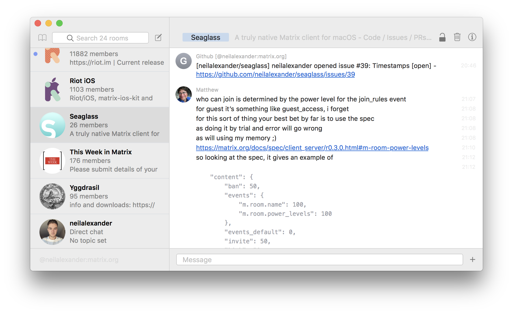

# Seaglass

Seaglass is a truly native macOS client for Matrix. It is written in Swift and
uses the Cocoa user interface framework.



## Building

Use Xcode 9.4 on macOS 10.13. Seaglass may require macOS 10.13 as a result of
using auto-layout for some table views, which seems to have been introduced with
High Sierra. I hope to find an alternate way to relax this requirement.

Right now I am building against Realm 3.7.1. This seems to actually build. The
Matrix iOS SDK requires an old version of Realm in the `Podfile` so we will fix
that by hand.

Clone it to a working directory of your choice:
```
mkdir WorkingDirectory
cd WorkingDirectory
git clone https://github.com/matrix-org/matrix-ios-sdk
```
Repair the `Podfile`:
```
cd matrix-ios-sdk
git checkout develop
sed -i '' "s/'Realm', '~> 3.3.2'/'Realm', '>= 3.6.0'/g" SwiftMatrixSDK.podspec
cd ..
```
Open up `MatrixSDK.xcodeproj` in Xcode.

Open the `File` menu, select `New` and then `Target`. Select `macOS` and then
choose `Cocoa Framework`. When prompted for a name, enter `MatrixSDKMac` and
click `Finish`.

Change target to `MatrixSDKMac` and then build.

Also within your working directory, clone the Seaglass repository and install
dependencies:
```
git clone https://github.com/neilalexander/seaglass
cd seaglass
pod install
```
Open up `Seaglass.xcworkspace` in Xcode and build!

## Things that work

- Logging in to a homeserver you are already registered with
- Seeing channels that you have already joined, completely without formatting
- Posting text to channels that you have already joined

## Things that don't work

- Anything else that isn't listed above!

## Goals

- Ability to join, leave, create, modify rooms
- Multimedia and Markdown formatting support
- Notifications for direct messages, highlights, invites, etc.
- End-to-end encryption support
- Look and feel like a first-class citizen on macOS

## Disclaimer

At this stage it is early in development and stands a good chance of being buggy
and unreliable. I'm also not a Swift expert - I only started using Swift three
or four days before my initial commit - and this code is probably awful. You've
been warned. :-)
